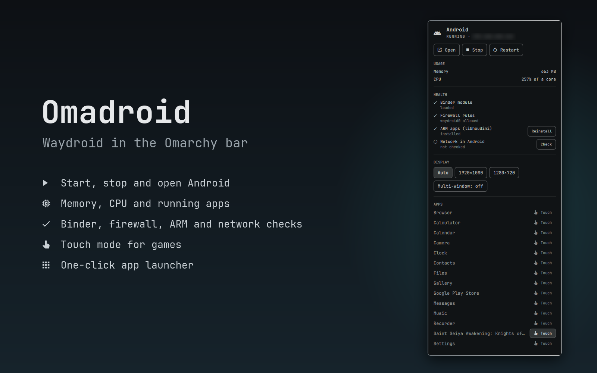

# Omadroid

[Waydroid](https://waydro.id) in the Omarchy bar: start and stop Android, launch
your Android apps, see what Android costs in memory and CPU, and find out why it
misbehaves.



## What it does

- **Bar icon**: dim when Android is stopped, lit when it runs, in the urgent
  colour when a health check fails. Left click opens the panel, right click
  opens Android.
- **Open / Stop / Restart**. Closing the Waydroid window leaves Android running
  in the background; **Stop** really shuts it down and gives the memory back.
- **Usage**: memory Android actually holds (not the image page cache), its CPU,
  and which of your apps are running.
- **Health checks**:
  - binder is available (built into the kernel, or as a DKMS module);
  - ufw, when active, allows DHCP, DNS and forwarding on `waydroid0`;
  - libhoudini is installed, so ARM-only apps and games run, with a
    **Reinstall** button;
  - Android actually has network, with a **Check** button. When Android lost
    its network, **Restart** fixes it.
- **Display**: fixed resolution (`persist.waydroid.width/height`) and
  multi-window mode (`persist.waydroid.multi_windows`), so Android fits a tile.
- **Apps**: one click opens any Android app. Each app has a **Touch** toggle
  (`persist.waydroid.fake_touch`): games that ignore mouse clicks, such as
  picking an attack target, get finger taps instead.
- **Keys in the panel**: `o` open, `s` stop, `r` refresh, `Esc` close.

Display and Touch settings can only be changed while Android runs, and apply
after a restart; the panel reminds you.

## Requirements

- Waydroid, initialised (`sudo waydroid init`), with binder available in the
  kernel.
- `jq` (Omarchy ships it).
- `pkexec` (polkit) for the two root actions.
- Optional, for **Reinstall** of libhoudini:
  [casualsnek/waydroid_script](https://github.com/casualsnek/waydroid_script)
  cloned with its virtual environment, by default in
  `~/.local/share/waydroid_script`:

  ```bash
  git clone https://github.com/casualsnek/waydroid_script ~/.local/share/waydroid_script
  cd ~/.local/share/waydroid_script
  python -m venv venv && venv/bin/pip install -r requirements.txt
  ```

## Install

```bash
omarchy plugin add https://github.com/dedeanth/omadroid.git --enable --yes
```

Omadroid lands in the right section of the bar.

## Remove

```bash
omarchy plugin disable io.github.dedeanth.omadroid
omarchy plugin remove io.github.dedeanth.omadroid
```

Omadroid changes nothing on its own. The Waydroid properties you set from the
panel stay in Waydroid; reset them with `waydroid prop set <key> ""`.

## Settings

| Key | Default | Meaning |
|---|---|---|
| `waydroidScriptDir` | `~/.local/share/waydroid_script` | waydroid_script checkout used to reinstall libhoudini |
| `readmePath` | empty | Optional notes file of your own, opened from the panel |

## Permissions

Everything runs as your user except two actions, which ask for your password
through pkexec every time:

- **Check** (network) runs `waydroid shell` to look inside Android;
- **Reinstall** (libhoudini) runs waydroid_script, which writes into the
  Waydroid images.

Both live in `omadroid-root.sh`. Nothing runs as root without that prompt.

## Files

- `Omadroid.qml` — the widget and its panel
- `omadroid.sh` — user-side backend; every command answers in one line of JSON
- `omadroid-root.sh` — the two root actions, run through pkexec

## IPC

```bash
quickshell ipc -p /usr/share/omarchy/shell call omadroid toggle   # also open, close, start, stop, status
```

## License

MIT, see [LICENSE](LICENSE).
